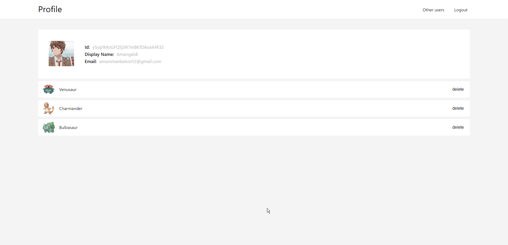

  

   A SPA Built using React with Firebase. 
   Works Online and can be installed. 
   Built using the PokéAPI.

   
Live : <a href="https://react-pokedex-ffe94.web.app">react-pokedex-ffe94.web.app</a> [For best experience use Chrome or any other Chromium-based browser]

Leave a :star: if you liked it, also share :link: with those who may be interested.

# Screenshots

 
 
 
 
 
 
 
 
 
 
 
 

## Technologies

* webpack
* react
* typescript
* firebase
* react-firebase-hooks
* axios
* react-router-dom
* react-query

## Getting started

# Getting Started:

**Setting up the environment:**
1. Install Node.js and use `node -v` to check version.
1. IMP Note: You might need to use sudo depending on the npm configuration.
1. Install webpack CLI as `npm install -g @webpack/cli`
1. Clone or download this repo.
1. Run `npm install` inside this project folder to install all dependencies.
1. Make sure you use the latest version of the CLI (upgrade guide below)

1. `npm start` for start
1. `npm run build:prod` build in production mode
1. `npm run build:dev` build in development mode

# Copyright Notice
This is an unofficial, non-commercial, fan-made app and is NOT affiliated, endorsed or supported by Nintendo, Game Freak and The Pokémon Company in any way. Many images used in this app are copyrighted and are supported under fair use. Pokémon and Pokémon character names are trademarks of Nintendo. No copyright infringement intended.

